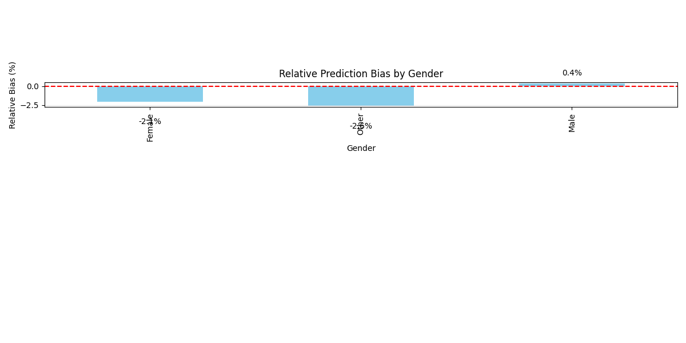
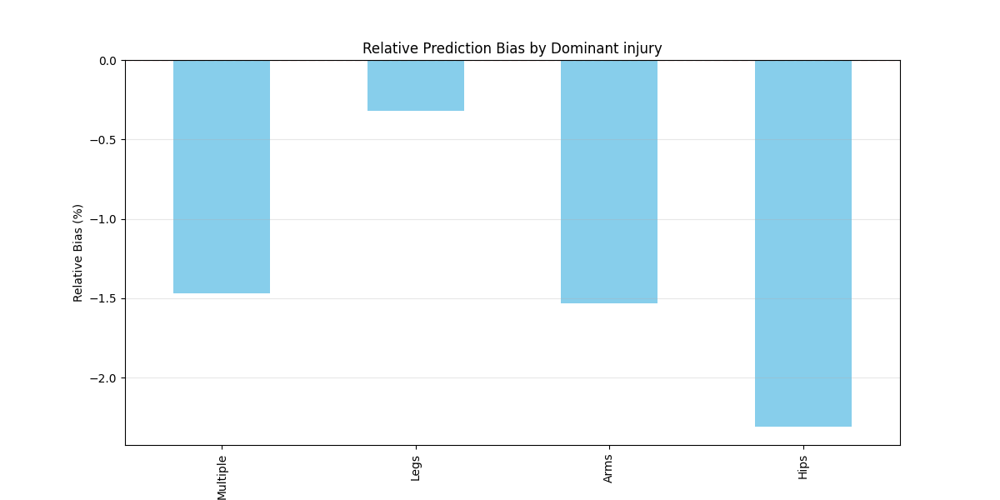
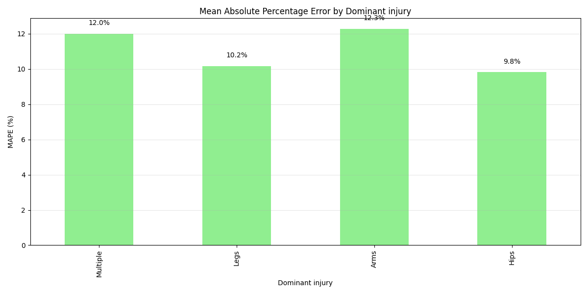
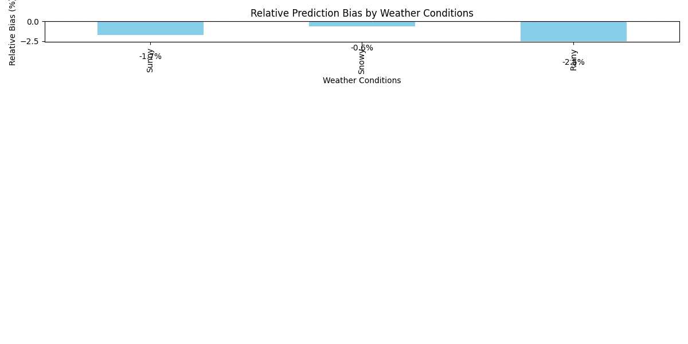
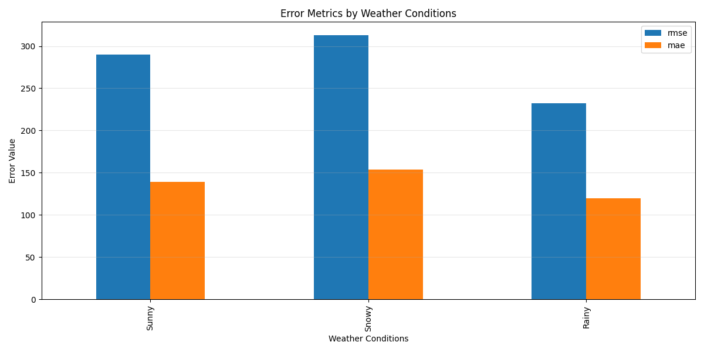
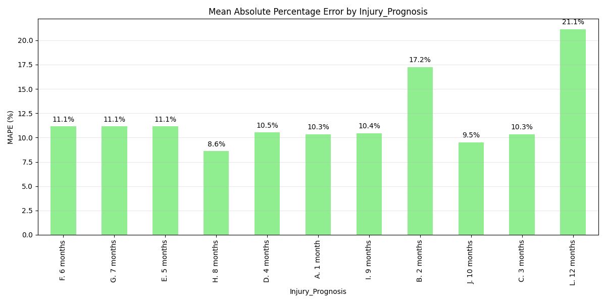

# Model Fairness Analysis Report

## Overview

This report analyses the fairness of the settlement value prediction model across different demographic and case-type groups.

Number of attributes analysed: 7

## Summary of Findings

| Attribute | Groups | Max Bias | Max RMSE | Notes |
|-----------|--------|----------|----------|-------|
| Gender | 3 | -2.6% (Other) | 302.9 (Female) |  |
| AccidentType | 12 | -8.3% (Other side reversed into Clt's vehicle) | 363.0 (Other side turned across Clt's path) | Some groups have low sample count.  |
| Dominant injury | 4 | -2.3% (Hips) | 304.3 (Multiple) |  |
| Whiplash | 2 | -2.2% (Yes) | 295.9 (No) |  |
| Vehicle Type | 3 | -2.4% (Motorcycle) | 327.6 (Motorcycle) |  |
| Weather Conditions | 3 | -2.5% (Rainy) | 313.0 (Snowy) |  |
| Injury_Prognosis | 11 | -6.1% (B. 2 months) | 410.8 (B. 2 months) | Some groups have low sample count.  |

## Detailed Analysis

### Gender

#### Key Insights

- Highest prediction bias: -2.6% for Other
- Lowest prediction bias: 0.4% for Male
- The model tends to **underpredict** for Other
- Highest percentage error: 11.3% for Female
- Lowest percentage error: 10.7% for Male

#### Visualisations

#### Metrics Table

|        |   count |    rmse |     mae |    mape |   mean_true |   mean_pred |      bias |   relative_bias |
|:-------|--------:|--------:|--------:|--------:|------------:|------------:|----------:|----------------:|
| Female |     336 | 302.892 | 143.87  | 11.3278 |     1231.19 |     1205.88 | -25.308   |       -2.05557  |
| Other  |     331 | 296.414 | 140.43  | 10.8887 |     1199.7  |     1168.29 | -31.4063  |       -2.61786  |
| Male   |     312 | 232.033 | 128.913 | 10.6958 |     1190.4  |     1195.33 |   4.92415 |        0.413654 |

---

### AccidentType

#### Key Insights

- Highest prediction bias: -8.3% for Other side reversed into Clt's vehicle
- Lowest prediction bias: -1.4% for Rear end
- The model tends to **underpredict** for Other side reversed into Clt's vehicle
- Highest percentage error: 17.5% for Other side pulled on to roundabout
- Lowest percentage error: 8.1% for Other side turned across Clt's path

WARNING: Low sample count (12) for Other side collided with Clt's parked vehicle. Results may not be reliable.

#### Visualisations

#### Metrics Table

|                                                                       |   count |    rmse |      mae |     mape |   mean_true |   mean_pred |     bias |   relative_bias |
|:----------------------------------------------------------------------|--------:|--------:|---------:|---------:|------------:|------------:|---------:|----------------:|
| Rear end                                                              |     492 | 280.944 | 143.99   | 11.2764  |     1227.2  |     1210.35 | -16.8472 |        -1.37281 |
| Other side pulled out of side road                                    |     121 | 325.93  | 171.414  | 12.1892  |     1276.15 |     1227.1  | -49.0483 |        -3.84345 |
| Other                                                                 |      76 | 274.562 | 121.271  | 10.5012  |     1126.01 |     1086.19 | -39.8249 |        -3.53681 |
| Other side turned across Clt's path                                   |      56 | 362.952 | 143.694  |  8.05369 |     1317.62 |     1268.93 | -48.6984 |        -3.69592 |
| Rear end - Clt pushed into next vehicle                               |      45 | 309.004 | 149.936  | 12.1643  |     1153.94 |     1172.51 |  18.5683 |         1.60913 |
| Other side changed lanes and collided with clt's vehicle              |      44 | 212.807 | 105.737  | 11.5385  |     1033    |     1065.39 |  32.3896 |         3.1355  |
| Rear end - 3 car - Clt at front                                       |      28 | 239.493 | 113.877  |  9.68216 |     1224.35 |     1207.54 | -16.8094 |        -1.37293 |
| Other side reversed into Clt's vehicle                                |      21 | 256.493 | 115.218  |  8.81374 |     1166.37 |     1069.86 | -96.512  |        -8.27456 |
| Other side pulled on to roundabout                                    |      16 | 152.68  | 117.671  | 17.5335  |     1222.82 |     1240.29 |  17.4667 |         1.4284  |
| Other side drove on wrong side of the road                            |      16 | 137.59  |  73.2776 |  9.81162 |     1040.76 |     1091.36 |  50.595  |         4.86134 |
| Other side changed lanes on a roundabout colliding with clt's vehicle |      14 | 119.316 |  78.6825 |  8.35262 |     1057.44 |     1019.37 | -38.0693 |        -3.60015 |
| Other side collided with Clt's parked vehicle                         |      12 | 169.62  |  97.1945 |  9.26854 |     1095.23 |     1171.74 |  76.508  |         6.98554 |

---

### Dominant injury

#### Key Insights

- Highest prediction bias: -2.3% for Hips
- Lowest prediction bias: -0.3% for Legs
- The model tends to **underpredict** for Hips
- Highest percentage error: 12.3% for Arms
- Lowest percentage error: 9.8% for Hips

#### Visualisations

#### Metrics Table

|          |   count |    rmse |     mae |     mape |   mean_true |   mean_pred |      bias |   relative_bias |
|:---------|--------:|--------:|--------:|---------:|------------:|------------:|----------:|----------------:|
| Multiple |     260 | 304.299 | 149.021 | 11.9885  |     1147.72 |     1130.87 | -16.8519  |       -1.4683   |
| Legs     |     249 | 228.17  | 130.984 | 10.162   |     1228.67 |     1224.76 |  -3.91449 |       -0.318595 |
| Arms     |     229 | 280.34  | 140.68  | 12.2576  |     1230.79 |     1211.94 | -18.852   |       -1.5317   |
| Hips     |     220 | 302.66  | 133.775 |  9.80904 |     1237.75 |     1209.18 | -28.5754  |       -2.30865  |

---

### Whiplash

#### Key Insights

- Highest prediction bias: -2.2% for Yes
- Lowest prediction bias: -0.8% for No
- The model tends to **underpredict** for Yes
- Highest percentage error: 11.5% for No
- Lowest percentage error: 10.5% for Yes

#### Visualisations

#### Metrics Table

|     |   count |    rmse |     mae |    mape |   mean_true |   mean_pred |      bias |   relative_bias |
|:----|--------:|--------:|--------:|--------:|------------:|------------:|----------:|----------------:|
| Yes |     495 | 263.209 | 132.76  | 10.4607 |     1204.19 |     1178.27 | -25.9216  |        -2.15262 |
| No  |     462 | 295.888 | 142.602 | 11.5088 |     1203.16 |     1193.92 |  -9.24388 |        -0.7683  |

---

### Vehicle Type

#### Key Insights

- Highest prediction bias: -2.4% for Motorcycle
- Lowest prediction bias: -0.7% for Car
- The model tends to **underpredict** for Motorcycle
- Highest percentage error: 11.5% for Motorcycle
- Lowest percentage error: 10.1% for Truck

#### Visualisations

#### Metrics Table

|            |   count |    rmse |     mae |    mape |   mean_true |   mean_pred |      bias |   relative_bias |
|:-----------|--------:|--------:|--------:|--------:|------------:|------------:|----------:|----------------:|
| Truck      |     331 | 258.747 | 119.856 | 10.1242 |     1152.99 |     1136.51 | -16.4812  |       -1.42944  |
| Car        |     316 | 254.015 | 131.27  | 11.0121 |     1200.2  |     1192.03 |  -8.16686 |       -0.680458 |
| Motorcycle |     310 | 327.555 | 163.969 | 11.4912 |     1259.05 |     1228.32 | -30.7258  |       -2.4404   |

---

### Weather Conditions

#### Key Insights

- Highest prediction bias: -2.5% for Rainy
- Lowest prediction bias: -0.6% for Snowy
- The model tends to **underpredict** for Rainy
- Highest percentage error: 12.4% for Snowy
- Lowest percentage error: 9.6% for Rainy

#### Visualisations

#### Metrics Table

|       |   count |    rmse |     mae |     mape |   mean_true |   mean_pred |      bias |   relative_bias |
|:------|--------:|--------:|--------:|---------:|------------:|------------:|----------:|----------------:|
| Sunny |     330 | 290.113 | 138.81  | 10.7802  |     1226.47 |     1205.36 | -21.1078  |       -1.72103  |
| Snowy |     328 | 313.017 | 154.012 | 12.4112  |     1166.25 |     1158.71 |  -7.53803 |       -0.646348 |
| Rainy |     299 | 232.132 | 119.822 |  9.60075 |     1237.71 |     1206.91 | -30.7963  |       -2.48817  |

---

### Injury_Prognosis

#### Key Insights

- Highest prediction bias: -6.1% for B. 2 months
- Lowest prediction bias: 0.0% for J. 10 months
- The model tends to **underpredict** for B. 2 months
- Highest percentage error: 21.1% for L. 12 months
- Lowest percentage error: 8.6% for H. 8 months

WARNING: Low sample count (16) for L. 12 months. Results may not be reliable.

#### Visualisations

#### Metrics Table

|              |   count |    rmse |      mae |     mape |   mean_true |   mean_pred |          bias |   relative_bias |
|:-------------|--------:|--------:|---------:|---------:|------------:|------------:|--------------:|----------------:|
| F. 6 months  |     220 | 275.059 | 147.87   | 11.1448  |     1250.27 |     1241.98 |  -8.29166     |    -0.663187    |
| G. 7 months  |     144 | 371.485 | 163.571  | 11.1367  |     1308.35 |     1263.41 | -44.9396      |    -3.43483     |
| E. 5 months  |     143 | 257.581 | 127.355  | 11.1396  |     1108.31 |     1116.79 |   8.4802      |     0.765148    |
| H. 8 months  |     116 | 186.149 | 100.147  |  8.59673 |     1078.18 |     1091    |  12.8207      |     1.18911     |
| D. 4 months  |      84 | 283.774 | 132.917  | 10.5195  |     1155.1  |     1127.78 | -27.3156      |    -2.36479     |
| A. 1 month   |      68 | 262.248 | 147.01   | 10.3268  |     1316.47 |     1247.76 | -68.7075      |    -5.21909     |
| I. 9 months  |      46 | 213.895 | 127.406  | 10.4432  |     1262.71 |     1228.22 | -34.4938      |    -2.73172     |
| B. 2 months  |      44 | 410.77  | 207.076  | 17.2457  |     1305.87 |     1226.18 | -79.6969      |    -6.10295     |
| J. 10 months |      35 | 159.998 |  90.8536 |  9.51858 |     1134.17 |     1134.17 |   0.000457031 |     4.02966e-05 |
| C. 3 months  |      22 | 292.874 | 138.498  | 10.328   |     1212.33 |     1250.08 |  37.7517      |     3.11397     |
| L. 12 months |      16 | 352.891 | 205.3    | 21.146   |     1447.25 |     1372.75 | -74.4971      |    -5.1475      |

---

## Recommendations

No high-priority fairness issues detected. Continue monitoring model performance across groups.

## Conclusion

This fairness analysis provides insights into how the settlement prediction model performs across different groups. The model appears to perform consistently across different groups, with no major fairness concerns identified. Continued monitoring is recommended as new data becomes available.

