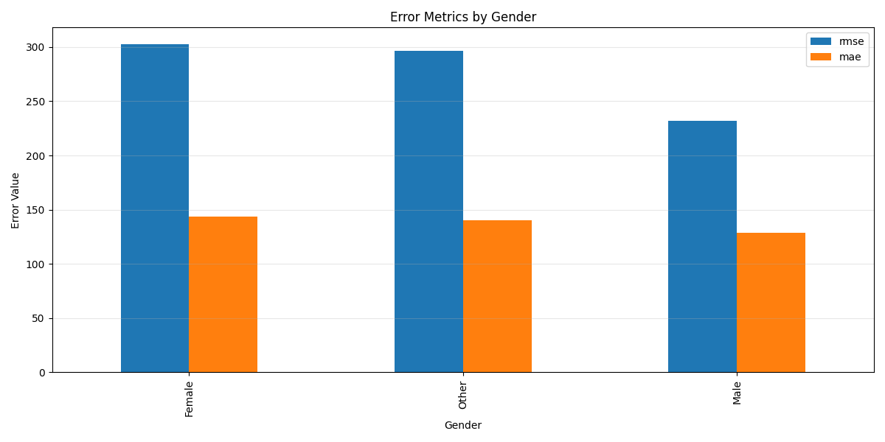
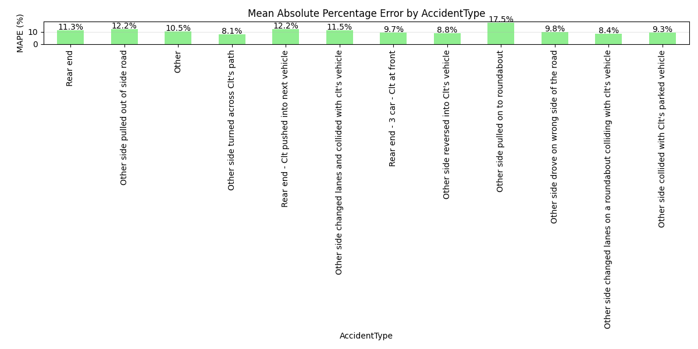
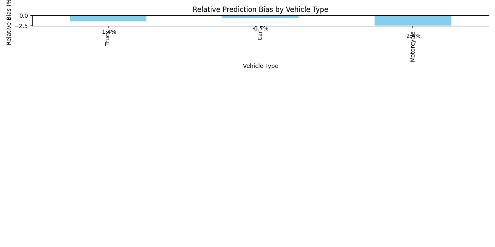

# Model Fairness Analysis Report

## Overview

This report analyzes the fairness of the settlement value prediction model across different demographic and case-type groups.

Number of attributes analyzed: 7

## Summary of Findings

| Attribute | Groups | Max Bias | Max RMSE | Notes |
|-----------|--------|----------|----------|-------|
| Gender | 3 | -1.4% (Female) | 339.9 (Male) |  |
| AccidentType | 12 | -10.8% (Other side changed lanes on a roundabout colliding with clt's vehicle) | 379.7 (Rear end - Clt pushed into next vehicle) | Some groups have low sample count.  |
| Vehicle Type | 3 | -2.5% (Truck) | 330.9 (Truck) |  |
| Injury_Prognosis | 11 | -8.2% (L. 12 months) | 465.1 (J. 10 months) | Some groups have low sample count.  |
| Weather Conditions | 3 | -3.9% (Rainy) | 339.1 (Sunny) |  |
| Dominant injury | 4 | -4.6% (Legs) | 346.2 (Arms) |  |
| Whiplash | 2 | -1.2% (Yes) | 339.8 (No) |  |

## Detailed Analysis

### Gender

#### Key Insights

- Highest prediction bias: -1.4% for Female
- Lowest prediction bias: -0.4% for Other
- The model tends to **underpredict** for Female
- Highest percentage error: 21.5% for Other
- Lowest percentage error: 19.4% for Female

#### Visualizations

#### Metrics Table

|        |   count |    rmse |     mae |    mape |   mean_true |   mean_pred |      bias |   relative_bias |
|:-------|--------:|--------:|--------:|--------:|------------:|------------:|----------:|----------------:|
| Female |     336 | 331.723 | 215.162 | 19.419  |     1227.96 |     1211.23 | -16.7276  |       -1.36223  |
| Other  |     331 | 320.586 | 217.141 | 21.4982 |     1185.18 |     1180.35 |  -4.82695 |       -0.407277 |
| Male   |     312 | 339.865 | 228.589 | 20.3902 |     1267.46 |     1251.59 | -15.8697  |       -1.25209  |

---

### AccidentType

#### Key Insights

- Highest prediction bias: -10.8% for Other side changed lanes on a roundabout colliding with clt's vehicle
- Lowest prediction bias: -0.3% for Other
- The model tends to **underpredict** for Other side changed lanes on a roundabout colliding with clt's vehicle
- Highest percentage error: 30.5% for Other side reversed into Clt's vehicle
- Lowest percentage error: 15.1% for Other side drove on wrong side of the road

WARNING: Low sample count (12) for Other side collided with Clt's parked vehicle. Results may not be reliable.

#### Visualizations

#### Metrics Table

|                                                                       |   count |    rmse |     mae |    mape |   mean_true |   mean_pred |       bias |   relative_bias |
|:----------------------------------------------------------------------|--------:|--------:|--------:|--------:|------------:|------------:|-----------:|----------------:|
| Rear end                                                              |     492 | 338.647 | 222.434 | 20.5602 |    1198.4   |    1188.08  |  -10.3181  |       -0.860986 |
| Other side pulled out of side road                                    |     121 | 351.038 | 227.255 | 21.0698 |    1213.96  |    1222.25  |    8.29512 |        0.683311 |
| Other                                                                 |      76 | 286.08  | 192.209 | 16.525  |    1282.01  |    1278.78  |   -3.22392 |       -0.251475 |
| Other side turned across Clt's path                                   |      56 | 303.736 | 218.382 | 24.7542 |    1240.65  |    1203.51  |  -37.1396  |       -2.99356  |
| Rear end - Clt pushed into next vehicle                               |      45 | 379.686 | 255.414 | 19.8556 |    1408.1   |    1366.63  |  -41.4766  |       -2.94557  |
| Other side changed lanes and collided with clt's vehicle              |      44 | 313.593 | 212.726 | 23.9384 |    1035.01  |    1019.16  |  -15.8423  |       -1.53065  |
| Rear end - 3 car - Clt at front                                       |      28 | 286.043 | 225.145 | 19.4843 |    1309.78  |    1246.86  |  -62.9131  |       -4.80335  |
| Other side reversed into Clt's vehicle                                |      21 | 351.57  | 231.683 | 30.4862 |    1278.86  |    1320.66  |   41.8057  |        3.26899  |
| Other side pulled on to roundabout                                    |      16 | 280.067 | 192.688 | 16.9579 |    1187.39  |    1267.19  |   79.8063  |        6.72117  |
| Other side drove on wrong side of the road                            |      16 | 347.514 | 237.844 | 15.1256 |    1364.54  |    1436.65  |   72.1039  |        5.2841   |
| Other side changed lanes on a roundabout colliding with clt's vehicle |      14 | 311.552 | 252.88  | 15.4772 |    2070.34  |    1847.62  | -222.721   |      -10.7577   |
| Other side collided with Clt's parked vehicle                         |      12 | 272.749 | 192.167 | 20.2337 |     920.285 |     900.609 |  -19.6755  |       -2.13798  |

---

### Vehicle Type

#### Key Insights

- Highest prediction bias: -2.5% for Truck
- Lowest prediction bias: -0.1% for Car
- The model tends to **underpredict** for Truck
- Highest percentage error: 21.9% for Car
- Lowest percentage error: 19.0% for Truck

#### Visualizations

#### Metrics Table

|            |   count |    rmse |     mae |    mape |   mean_true |   mean_pred |      bias |   relative_bias |
|:-----------|--------:|--------:|--------:|--------:|------------:|------------:|----------:|----------------:|
| Truck      |     331 | 330.914 | 221.727 | 19.0359 |     1295.29 |     1262.53 | -32.7565  |       -2.5289   |
| Car        |     316 | 330.109 | 227.729 | 21.8932 |     1195.41 |     1194.21 |  -1.19674 |       -0.100112 |
| Motorcycle |     310 | 329.81  | 208.115 | 20.0575 |     1195.72 |     1192.39 |  -3.32623 |       -0.278178 |

---

### Injury_Prognosis

#### Key Insights

- Highest prediction bias: -8.2% for L. 12 months
- Lowest prediction bias: -0.2% for E. 5 months
- The model tends to **underpredict** for L. 12 months
- Highest percentage error: 24.8% for J. 10 months
- Lowest percentage error: 14.7% for C. 3 months

WARNING: Low sample count (16) for L. 12 months. Results may not be reliable.

#### Visualizations

#### Metrics Table

|              |   count |    rmse |     mae |    mape |   mean_true |   mean_pred |       bias |   relative_bias |
|:-------------|--------:|--------:|--------:|--------:|------------:|------------:|-----------:|----------------:|
| F. 6 months  |     220 | 325.477 | 224.836 | 21.6353 |     1198.11 |     1156.21 |  -41.8956  |       -3.49681  |
| G. 7 months  |     144 | 318.05  | 209.634 | 19.8805 |     1213.88 |     1239.59 |   25.7096  |        2.11796  |
| E. 5 months  |     143 | 368.276 | 236.443 | 21.5048 |     1281.11 |     1279.04 |   -2.07226 |       -0.161755 |
| H. 8 months  |     116 | 336.039 | 232.05  | 20.4618 |     1256.01 |     1274.55 |   18.5338  |        1.47561  |
| D. 4 months  |      84 | 337.729 | 223.76  | 20.6904 |     1314.38 |     1323    |    8.6116  |        0.655181 |
| A. 1 month   |      68 | 254.316 | 171.316 | 19.195  |     1043.34 |     1022.52 |  -20.816   |       -1.99514  |
| I. 9 months  |      46 | 383.477 | 244.493 | 21.0701 |     1345.23 |     1315.31 |  -29.9215  |       -2.22427  |
| B. 2 months  |      44 | 275.217 | 206.023 | 20.2221 |     1155.91 |     1174.88 |   18.974   |        1.64148  |
| J. 10 months |      35 | 465.141 | 315.834 | 24.805  |     1323.54 |     1269.33 |  -54.2135  |       -4.0961   |
| C. 3 months  |      22 | 225.867 | 145.96  | 14.7384 |     1047.02 |     1008.76 |  -38.2551  |       -3.65372  |
| L. 12 months |      16 | 230.601 | 177.848 | 15.023  |     1218.59 |     1118.34 | -100.253   |       -8.22699  |

---

### Weather Conditions

#### Key Insights

- Highest prediction bias: -3.9% for Rainy
- Lowest prediction bias: -1.1% for Sunny
- The model tends to **underpredict** for Rainy
- Highest percentage error: 21.5% for Snowy
- Lowest percentage error: 18.5% for Rainy

#### Visualizations

#### Metrics Table

|       |   count |    rmse |     mae |    mape |   mean_true |   mean_pred |     bias |   relative_bias |
|:------|--------:|--------:|--------:|--------:|------------:|------------:|---------:|----------------:|
| Sunny |     330 | 339.113 | 230.093 | 21.0373 |     1206.39 |     1192.85 | -13.5378 |        -1.12218 |
| Snowy |     328 | 320.336 | 218.032 | 21.5333 |     1224.84 |     1248.41 |  23.5781 |         1.925   |
| Rainy |     299 | 334.565 | 212.384 | 18.5106 |     1247.44 |     1198.35 | -49.0883 |        -3.93512 |

---

### Dominant injury

#### Key Insights

- Highest prediction bias: -4.6% for Legs
- Lowest prediction bias: 0.1% for Hips
- The model tends to **underpredict** for Legs
- Highest percentage error: 21.1% for Hips
- Lowest percentage error: 19.5% for Arms

#### Visualizations

#### Metrics Table

|          |   count |    rmse |     mae |    mape |   mean_true |   mean_pred |       bias |   relative_bias |
|:---------|--------:|--------:|--------:|--------:|------------:|------------:|-----------:|----------------:|
| Multiple |     260 | 312.69  | 212.596 | 20.4016 |     1168.14 |     1163.72 |  -4.4209   |      -0.378455  |
| Legs     |     249 | 338.317 | 225.305 | 20.3932 |     1256.2  |     1198.66 | -57.5428   |      -4.5807    |
| Arms     |     229 | 346.205 | 215.043 | 19.5192 |     1223.04 |     1238.5  |  15.4577   |       1.26387   |
| Hips     |     220 | 318.177 | 222.256 | 21.0587 |     1248.24 |     1249.13 |   0.884794 |       0.0708832 |

---

### Whiplash

#### Key Insights

- Highest prediction bias: -1.2% for Yes
- Lowest prediction bias: -0.9% for No
- The model tends to **underpredict** for Yes
- Highest percentage error: 21.0% for No
- Lowest percentage error: 19.7% for Yes

#### Visualizations

#### Metrics Table

|     |   count |    rmse |     mae |    mape |   mean_true |   mean_pred |     bias |   relative_bias |
|:----|--------:|--------:|--------:|--------:|------------:|------------:|---------:|----------------:|
| Yes |     495 | 321.51  | 216.239 | 19.741  |     1241.37 |     1226.46 | -14.9137 |       -1.20139  |
| No  |     462 | 339.813 | 223.545 | 20.9874 |     1211.53 |     1200.41 | -11.1176 |       -0.917649 |

---

## Recommendations

No high-priority fairness issues detected. Continue monitoring model performance across groups.

## Conclusion

This fairness analysis provides insights into how the settlement prediction model performs across different groups. The model appears to perform consistently across different groups, with no major fairness concerns identified. Continued monitoring is recommended as new data becomes available.

