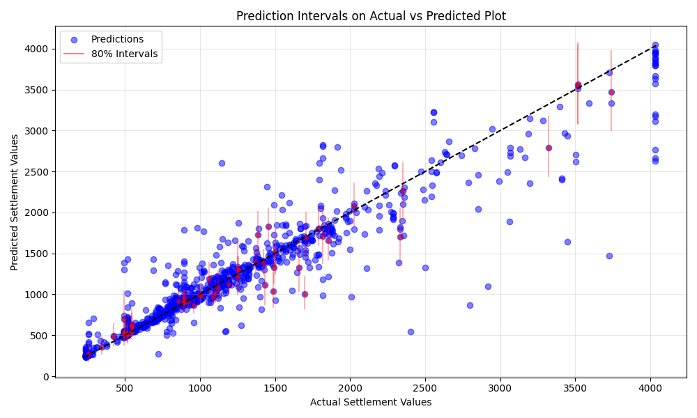

# Prediction Uncertainty Analysis

## Overview

- **80% Prediction interval coverage**: 70.68%
- **Average interval width**: £602.09
- **Average relative width**: 43.27% of settlement value

## Coverage by Settlement Value

| Settlement Value Range | Coverage (%) | Avg Interval Width |
|------------------------|--------------|--------------------|
| (239.999, 681.0] | 67.48% | £202.32 |
| (681.0, 973.12] | 72.65% | £247.86 |
| (973.12, 1500.0] | 75.30% | £465.79 |
| (1500.0, 6976.96] | 67.22% | £1509.97 |

## Visualizations

### Prediction Intervals for Sample Cases

### Scatter Plot with Intervals

### Distribution of Interval Widths

## Interpretation

The prediction intervals are too narrow, resulting in lower than expected coverage. This level of uncertainty quantification helps stakeholders understand the reliability of individual predictions and can be used to identify cases where additional information might be needed before making decisions.

## Recommendations

1. Consider the prediction interval when making settlement decisions, not just the point estimate
2. For cases with wide prediction intervals, gather additional information to reduce uncertainty
3. Monitor the coverage of prediction intervals over time to ensure they remain well-calibrated
