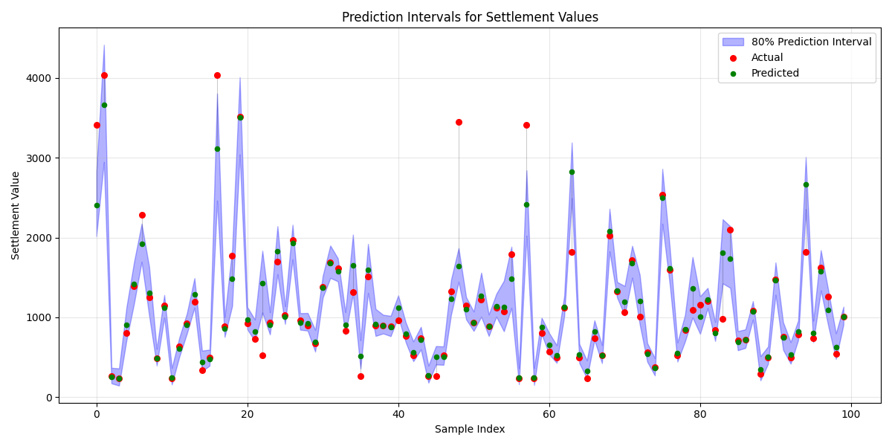

# Prediction Uncertainty Analysis

## Overview

- **80% Prediction interval coverage**: 83.45%
- **Average interval width**: £394.23
- **Average relative width**: 39.62% of settlement value

## Coverage by Settlement Value

| Settlement Value Range | Coverage (%) | Avg Interval Width |
|------------------------|--------------|--------------------|
| (239.999, 640.3] | 91.84% | £252.13 |
| (640.3, 982.0] | 86.12% | £304.44 |
| (982.0, 1519.095] | 85.66% | £375.57 |
| (1519.095, 4032.58] | 70.20% | £644.69 |

## Visualizations

### Prediction Intervals for Sample Cases

### Scatter Plot with Intervals

### Distribution of Interval Widths

### Reliability Diagram

### Uncertainty vs Error Analysis

## Interpretation

The prediction intervals are well-calibrated, providing close to the expected 80% coverage. This level of uncertainty quantification helps stakeholders understand the reliability of individual predictions and can be used to identify cases where additional information might be needed before making decisions.

## Key Insights

- **Moderate correlation** between prediction uncertainty and error, suggesting the model has some awareness of prediction difficulty.
- **Large variation in coverage** across different settlement value ranges, with a difference of 21.6% between the highest and lowest coverage segments.

## Recommendations

1. Consider the prediction interval when making settlement decisions, not just the point estimate
2. For cases with wide prediction intervals, gather additional information to reduce uncertainty
3. Monitor the coverage of prediction intervals over time to ensure they remain well-calibrated
5. Investigate why coverage varies significantly across different settlement value ranges
